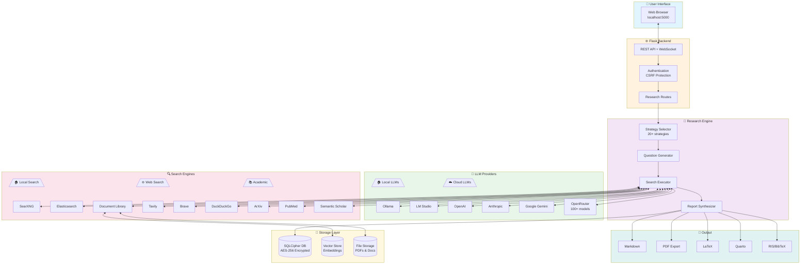
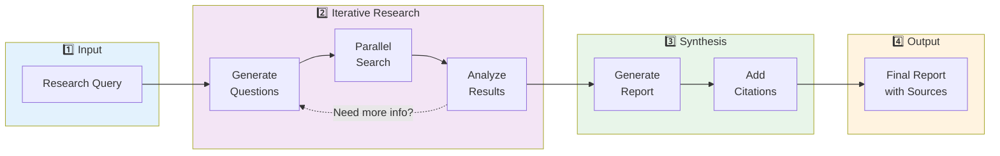
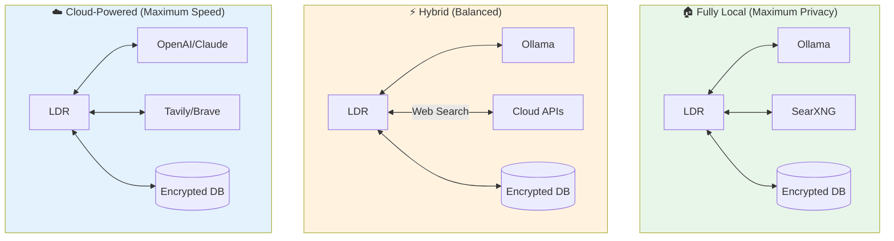
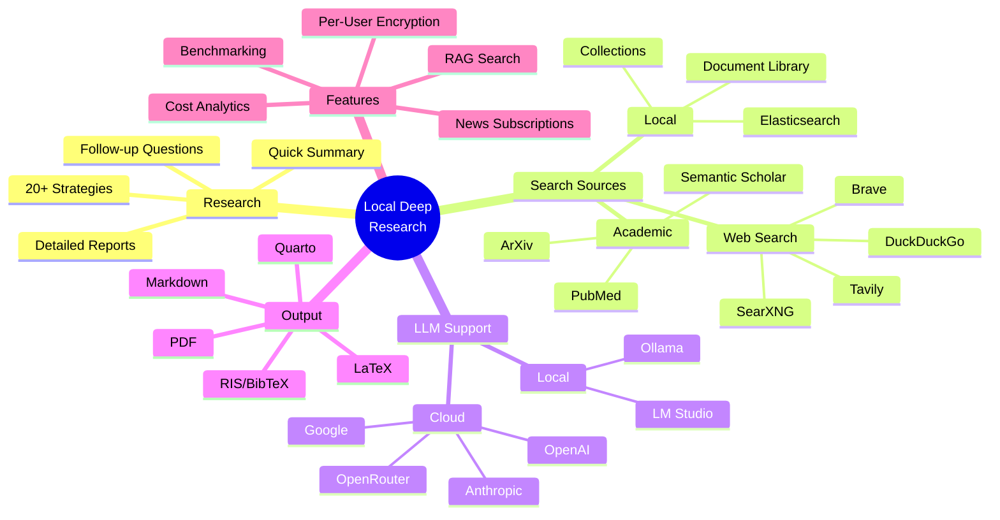
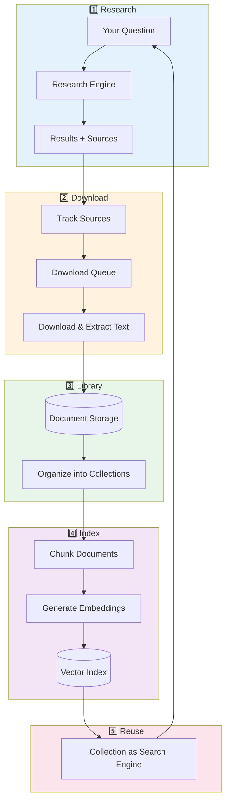
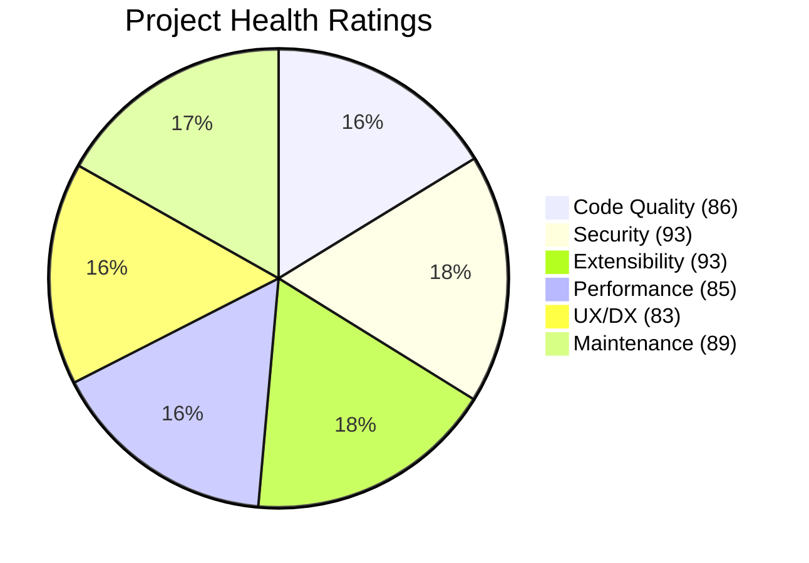
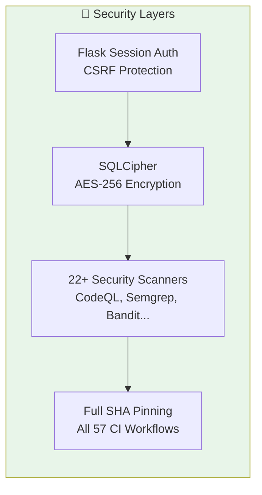
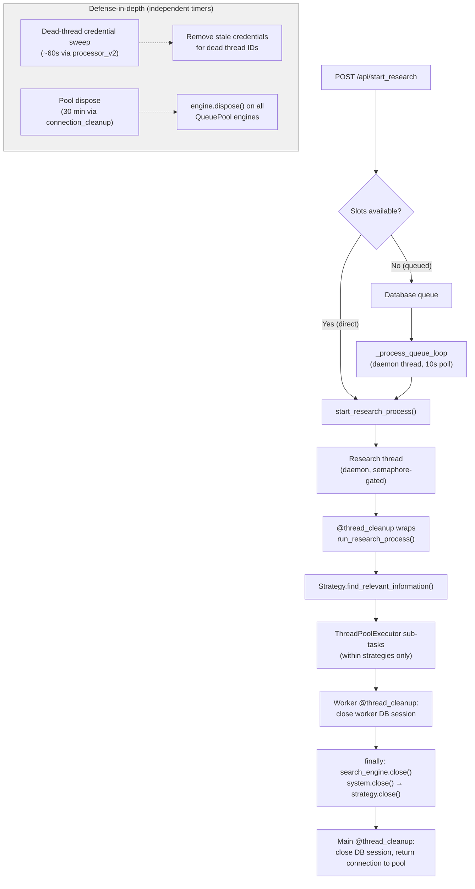

# Architecture Overview

This document provides detailed technical diagrams of Local Deep Research's architecture.

## System Architecture



## Research Flow



## Deployment Options



## Feature Map



## Component Details

### LLM Providers

| Provider | Type | Description |
|----------|------|-------------|
| Ollama | Local | Self-hosted open-source models |
| LM Studio | Local | Desktop app for local models |
| OpenAI | Cloud | GPT-4, GPT-3.5 |
| Anthropic | Cloud | Claude 3 family |
| Google | Cloud | Gemini models |
| OpenRouter | Cloud | 100+ models via single API |

### Search Engines

| Engine | Type | Best For |
|--------|------|----------|
| SearXNG | Local/Self-hosted | Privacy, aggregated results |
| Tavily | Cloud | AI-optimized search |
| ArXiv | Academic | Physics, CS, Math papers |
| PubMed | Academic | Biomedical research |
| Semantic Scholar | Academic | Cross-discipline papers |
| Wikipedia | Knowledge | General knowledge |
| Your Documents | Local | Private document search |

### Output Formats

| Format | Use Case |
|--------|----------|
| Markdown | Default, web display |
| PDF | Sharing, printing |
| LaTeX | Academic papers |
| Quarto | Reproducible documents |
| RIS/BibTeX | Reference managers |

## Knowledge Loop: Research → Library → Future Research

One of LDR's powerful features is the ability to build a personal knowledge base that improves future research.



### How It Works

1. **Research Completes** → Sources are tracked in `ResearchResource` table
2. **Download Sources** → Click "Get All Research PDFs" to queue downloads
   - Smart downloaders for ArXiv, PubMed, Semantic Scholar, etc.
   - Automatic text extraction from PDFs
3. **Build Library** → Documents stored in encrypted database
   - Deduplication via content hash
   - Multiple storage modes: database (encrypted), filesystem, text-only
4. **Create Collections** → Organize documents by topic/project
   - Each collection can have different embedding settings
   - Documents can belong to multiple collections
5. **Index for Search** → Generate vector embeddings
   - Configurable chunk size and overlap
   - FAISS index for fast similarity search
6. **Use in Future Research** → Select collection as search engine
   - RAG search finds relevant passages
   - Results cite back to your documents

### Key Components

| Component | Purpose |
|-----------|---------|
| `DownloadService` | Manages PDF downloads with source-specific strategies |
| `LibraryService` | Queries and manages document library |
| `LibraryRAGService` | Creates vector indices for semantic search |
| `CollectionSearchEngine` | Searches collections using RAG |
| `Document` | Stores text content, metadata, file references |
| `DocumentChunk` | Stores indexed text chunks with embeddings |
| `Collection` | Groups documents with shared embedding settings |

### Storage Options

| Mode | Security | Use Case |
|------|----------|----------|
| Database | AES-256 encrypted | Default, maximum security |
| Filesystem | Unencrypted | Need external tool access |
| Text Only | Encrypted text, no PDFs | Minimal storage |

---

## Technical Analysis & Project Health

*Last updated: December 2024*

This section provides a comprehensive technical analysis of the codebase, including quality metrics, architecture patterns, and project health indicators.

### Project Statistics

| Metric | Count |
|--------|-------|
| Test Classes | 809+ |
| Search Engine Implementations | 25 |
| LLM Provider Implementations | 9 |
| Search Strategies | 20+ |
| Abstract Base Classes | 26 |
| CI/CD Workflows | 57 |
| Security Scanners in CI | 22+ |
| Core Dependencies | 63 |

### Architecture Patterns

#### Extensibility Design

The codebase follows a consistent pattern for extensibility:

```
┌─────────────────────────────────────────────────────────────┐
│                    Abstract Base Classes                     │
├─────────────────────────────────────────────────────────────┤
│ BaseSearchEngine      │ Common interface for 25+ engines    │
│ BaseSearchStrategy    │ Strategy pattern for research       │
│ BaseCitationHandler   │ Citation processing abstraction     │
│ BaseQuestionGenerator │ Question generation interface       │
│ BaseExporter          │ Export format abstraction           │
└─────────────────────────────────────────────────────────────┘
```

#### Search Engine Plugin System

New search engines can be added by:
1. Creating a class inheriting from `BaseSearchEngine`
2. Placing it in `web_search_engines/engines/`
3. Auto-discovery handles registration

```python
# Example: Adding a new search engine
class SearchEngineCustom(BaseSearchEngine):
    def run(self, query: str) -> List[Dict]:
        # Implementation
        pass
```

#### LLM Provider Integration

Supports 9 LLM providers with auto-discovery:
- Ollama (local)
- LM Studio (local)
- OpenAI
- Anthropic
- Google Gemini
- OpenRouter (100+ models)
- DeepSeek
- Mistral
- Groq

### Quality Ratings



#### Detailed Ratings

| Category | Score | Highlights |
|----------|-------|------------|
| **Code Quality** | 86/100 | 809+ test classes, ruff/mypy enforcement, comprehensive pre-commit hooks |
| **Security** | 93/100 | SQLCipher AES-256 encryption, full SHA pinning in CI, 22+ security scanners |
| **Extensibility** | 93/100 | 26 abstract base classes, plugin architecture, strategy pattern throughout |
| **Performance** | 85/100 | Adaptive rate limiting, cache stampede protection, parallel search execution |
| **UX/Developer Experience** | 83/100 | Real-time WebSocket updates, in-tool documentation, comprehensive error handling |
| **Maintenance** | 89/100 | 57 CI/CD workflows, automated security scanning, structured changelog |
| **Overall** | 88/100 | Production-ready with excellent security and extensibility |

### Security Architecture



**Security Features:**
- Per-user encrypted databases (SQLCipher with AES-256)
- Full GitHub Action SHA pinning (not tag-based)
- Comprehensive CI security scanning:
  - CodeQL (Python, JavaScript)
  - Semgrep (custom rulesets)
  - Bandit (Python security)
  - Trivy (container scanning)
  - Dependency review
  - Secret scanning

### Performance Optimizations

| Feature | Implementation |
|---------|----------------|
| **Parallel Search** | `concurrent.futures.ThreadPoolExecutor` for multi-question search |
| **Rate Limiting** | Adaptive system with `learning_rate=0.3` |
| **Cache Protection** | `fetch_events` + `fetch_locks` for stampede prevention |
| **Progress Streaming** | SocketIO for real-time UI updates |
| **Cross-Engine Filtering** | LLM-powered relevance scoring and deduplication |

#### Thread & Resource Lifecycle

Unlike typical web apps that share a single database connection pool, this application maintains **separate database engines per user** because each user has their own encrypted SQLite file with a unique SQLCipher key ([SQLCipher](https://www.zetetic.net/sqlcipher/) is an encrypted extension of SQLite). This creates a threading challenge: every background thread needs its own engine for the user it serves.

A single **QueuePool** engine is kept per user (`pool_size=20`,
`max_overflow=40`, `pool_timeout=10`) in
`DatabaseManager.connections[username]`. It is created with
`check_same_thread=False`, so it is shared safely across Flask
request-handler threads AND background threads (research workers,
scheduler jobs, metric writers). All of these acquire sessions from the
same pool, which keeps FD usage bounded by `pool_size + max_overflow`
per user.

> Earlier revisions of the code maintained a second, parallel system of
> per-`(username, thread_id)` **NullPool** engines for background metric
> writes. That system was removed because orphaned entries leaked
> SQLCipher + WAL file handles (3 FDs per active connection) under load,
> eventually exhausting the 1024 FD soft limit. Routing all work through
> the single per-user QueuePool made FD usage bounded and let us delete
> ~200 lines of thread-engine bookkeeping.

##### Resource Cleanup Layers

Cleanup is defense-in-depth with multiple layers:

| Layer | Trigger | What it cleans |
|-------|---------|----------------|
| `@thread_cleanup` decorator | Thread function exit (normal or exception) | DB session (returned to per-user pool), settings context, search context |
| `finally` blocks | Per-research in `run_research_process()` | Search engine HTTP sessions, strategy thread pool executors |
| `teardown_appcontext` | After each HTTP request | QueuePool session, thread-local session, triggers dead-thread credential sweep |
| Periodic pool dispose | Every 30 min | Calls `engine.dispose()` on per-user QueuePool engines to release SQLCipher+WAL file handles that accumulate from out-of-order connection closes |
| Logout cascade | User logout | Scheduler unregister (removes password) → DB close (`engine.dispose()`) → session destroy |
| Stale session cleanup | `before_request` (~1% of requests, sampled) | Clears Flask sessions for users whose DB connection is gone |

##### Research Thread Lifecycle



##### FD Budget

Each SQLCipher connection in WAL (Write-Ahead Logging) mode uses **2 file descriptors** (main db + WAL file). All connections to the same database within a process share **1 SHM** (shared-memory) file descriptor. The formula per user database is: `connections × 2 + 1`.

| Component | FD Formula | With defaults |
|-----------|-----------|---------------|
| QueuePool (steady state) | `logged_in_users × (pool_size × 2 + 1)` | `users × 41` FDs |
| QueuePool (peak) | `logged_in_users × ((pool_size + max_overflow) × 2 + 1)` | `users × 121` FDs |

Default Linux ulimit is 1024 soft (bare metal), which is tight for multi-user deployments. Docker's daemon default (typically 1M+) is adequate. QueuePool engines are created at login and disposed at logout, so only active users consume FDs.

For more on diagnosing FD exhaustion, see [Troubleshooting - Resource Exhaustion](./troubleshooting.md#resource-exhaustion).

##### Key Files

| File | Role |
|------|------|
| `src/local_deep_research/database/encrypted_db.py` | `DatabaseManager`, engine lifecycle, pool management |
| `src/local_deep_research/database/thread_local_session.py` | `@thread_cleanup` decorator, thread-local sessions, credential cleanup |
| `src/local_deep_research/web/app_factory.py` | `teardown_appcontext` handler, cleanup orchestration |
| `src/local_deep_research/web/services/research_service.py` | Research thread creation, `run_research_process()` |
| `src/local_deep_research/web/queue/processor_v2.py` | Queue processing, credential cleanup trigger |

### Areas for Improvement

While the project scores highly overall, these areas have room for growth:

1. **Integration Testing** - More end-to-end tests for full research workflows
2. **API Documentation** - OpenAPI/Swagger spec for REST endpoints
3. **Metrics Dashboard** - Prometheus/Grafana integration for monitoring
4. **Resource Observability** - Expose FD count, thread count, and connection pool stats in /api/v1/health; add periodic sweep logging
5. **Async Architecture** - Migration to async/await for I/O-bound operations

### Key Source Files

| Component | Location | Purpose |
|-----------|----------|---------|
| Research Engine | `src/local_deep_research/search_system.py` | Main `AdvancedSearchSystem` class |
| Strategies | `src/local_deep_research/advanced_search_system/strategies/` | 20+ research strategies |
| Search Engines | `src/local_deep_research/web_search_engines/engines/` | 25 search engine implementations |
| Report Generation | `src/local_deep_research/report_generator.py` | `IntegratedReportGenerator` |
| Web API | `src/local_deep_research/web/routes/` | Flask routes and WebSocket handlers |
| Database | `src/local_deep_research/web/database/` | SQLCipher models and migrations |
| Encrypted DB | `src/local_deep_research/database/encrypted_db.py` | Per-user SQLCipher engine lifecycle |
| Thread Sessions | `src/local_deep_research/database/thread_local_session.py` | Thread-safe session management and cleanup |
| Settings | `src/local_deep_research/config/` | Configuration and LLM setup |

### Contributing to Architecture

When extending the system:

1. **Adding Search Engines**: Inherit from `BaseSearchEngine`, implement `run()` method
2. **Adding Strategies**: Inherit from `BaseSearchStrategy`, implement `analyze_topic()` method
3. **Adding LLM Providers**: Add to `config/llm_config.py` with proper initialization
4. **Adding Export Formats**: Inherit from base exporter pattern in `utilities/`

See [CONTRIBUTING.md](../CONTRIBUTING.md) for detailed guidelines.
