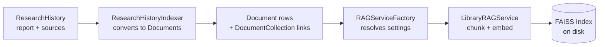
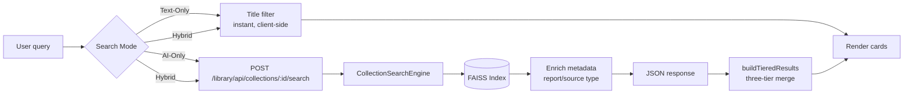

# Semantic Search

Semantic search lets users find research by meaning, not just title keywords. It indexes completed research reports and their sources into FAISS vector stores, then offers three search modes -- Hybrid (default), Text-Only, and AI-Only -- with a three-tier ranked merge algorithm for hybrid results.

## Table of Contents

- [Indexing Pipeline](#indexing-pipeline)
- [Search Pipeline](#search-pipeline)
- [Three-Tier Merge Algorithm](#three-tier-merge-algorithm)
- [File Structure](#file-structure)
- [API Routes](#api-routes)
- [Reusing on Other Pages](#reusing-on-other-pages)
- [See Also](#see-also)

---

## Indexing Pipeline



**Steps:**

1. `ResearchHistoryIndexer` reads completed `ResearchHistory` rows and their `ResearchResource` sources.
2. Each report becomes a `Document` (source\_type `research_report`). Each source with sufficient content becomes a `Document` (source\_type `research_source`).
3. Documents are linked to the History `Collection` via `DocumentCollection`.
4. `RAGServiceFactory` creates a `LibraryRAGService` with the collection's embedding settings.
5. `LibraryRAGService` chunks each document, generates embeddings, and writes the FAISS index to disk.

Bulk indexing uses **SSE streaming** -- the `/index` endpoint yields progress events (`start`, `progress`, `complete`, `error`) so the frontend can show a real-time progress bar.

---

## Search Pipeline



**Text filter** runs instantly on the client against cached history items. **Semantic search** is an async `POST` to the collection search endpoint, which delegates to `CollectionSearchEngine` for FAISS similarity search. In **Hybrid mode**, text results render immediately while the semantic call runs in the background; once it resolves, `buildTieredResults` merges both result sets into three tiers and re-renders.

---

## Three-Tier Merge Algorithm

Implemented in `semantic_search.js :: buildTieredResults()`.

| Tier | Contents | Sort Order |
|------|----------|------------|
| **Tier 1** | Matched both text filter AND semantic search | Similarity score DESC |
| **Tier 2** | Text-only matches (no semantic hit) | Original order (recency) |
| **Tier 3** | Semantic-only matches (below a visual divider) | Similarity score DESC |

The merge groups semantic results by `research_id` (keeping the best similarity per research), then classifies each text result as Tier 1 or Tier 2 based on whether a corresponding semantic match exists. Remaining semantic-only results become Tier 3.

---

## File Structure

### Backend

```
research_library/
├── search/                              # Semantic search subpackage
│   ├── __init__.py                      # Exports search_bp, ResearchHistoryIndexer
│   ├── routes/
│   │   └── search_routes.py             # 4 endpoints + _enrich helper
│   └── services/
│       └── research_history_indexer.py   # Converts ResearchHistory -> Documents -> RAG
├── services/
│   ├── rag_service_factory.py           # Creates LibraryRAGService with collection settings
│   └── library_rag_service.py           # FAISS indexing, chunking, embedding management
```

### Frontend

```
js/components/
├── semantic_search.js     # Shared module (window.SemanticSearch):
│                          #   renderSnippet, buildTieredResults,
│                          #   createSemanticResultCard, isSafeExternalUrl
├── history.js             # Page controller: mode switching, hybrid merge, rendering
└── history_search.js      # Indexing UI, semantic API calls, collection ID caching

js/config/
└── constants.js           # LDR_CONSTANTS.SEARCH_MODE: HYBRID | TEXT | SEMANTIC

css/components/
└── semantic-search.css    # All semantic search styles (badges, cards, dividers)
```

---

## API Routes

All routes require `@login_required`. Blueprint prefix: `/library`.

| Method | Path | Purpose |
|--------|------|---------|
| `GET` | `/api/research-history/collection` | Get collection ID and indexing status (auto-converts unconverted entries) |
| `POST` | `/api/research-history/convert-all` | Convert all completed research to Documents |
| `POST` | `/api/research/<id>/add-to-collection` | Add research to a custom collection |
| `POST` | `/api/collections/<id>/search` | Semantic search any collection (generic) |

The search endpoint is **collection-agnostic** -- it works for any collection type. For `research_history` collections, results are enriched with report/source type metadata.

---

## Reusing on Other Pages

The `semantic_search.js` shared module is designed for reuse on library or collection pages.

1. **Load the shared assets** in your template (order matters):
   ```html
   <link rel="stylesheet" href="/static/css/components/semantic-search.css">
   <script defer src="/static/js/components/semantic_search.js"></script>
   ```

2. **Call the search endpoint** with `POST /library/api/collections/<collection_id>/search`:
   ```javascript
   const response = await fetch(`/library/api/collections/${collectionId}/search`, {
       method: 'POST',
       headers: { 'Content-Type': 'application/json' },
       body: JSON.stringify({ query: 'your search', limit: 10 }),
   });
   const { results } = await response.json();
   ```

3. **Render results** using the shared utilities:
   ```javascript
   for (const result of results) {
       container.appendChild(SemanticSearch.createSemanticResultCard(result));
   }

   // Or for hybrid mode with text + semantic merge:
   const tiered = SemanticSearch.buildTieredResults(textResults, semanticResults);
   // tiered.tier1, tiered.tier2, tiered.tier3
   ```

No backend changes needed -- the search route and `CollectionSearchEngine` already support any collection type.

---

## See Also

- [Architecture Overview](./OVERVIEW.md) -- System architecture
- [Database Schema](./DATABASE_SCHEMA.md) -- Document, Collection, and DocumentCollection models
- [Library & RAG Guide](../library-and-rag.md) -- User-facing guide to library and search features
